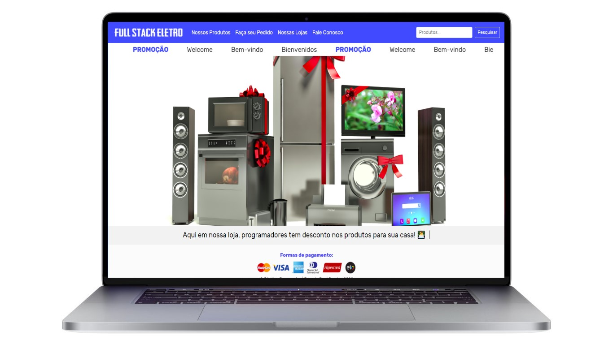

# Projeto Loja Virtual React + Node 

Esse projeto também utilizou BootStrap.

  

 

## Como Rodar o Projeto:

Depois de clonar esse diretório, instalar dependências:

### `yarn install`

No diretório do projeto, rodar o comando:

### `yarn start`

No diretório Backend, roda Api com arquivo ./server.js, rodar o comando:

### `nodemon ./server.js` ou somente:

### `node ./server.js` 

Abra [http://localhost:3000] para ver projeto React.

(http://localhost:8080) para ver dados Api do MongoDB.

Recode Pro 2021 by dgsdev
